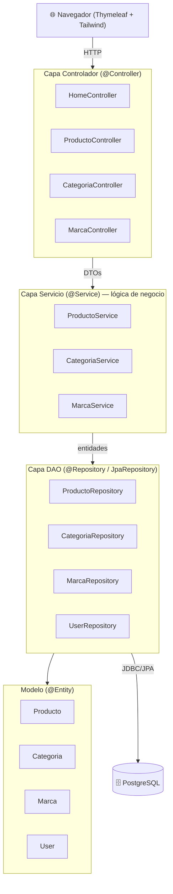
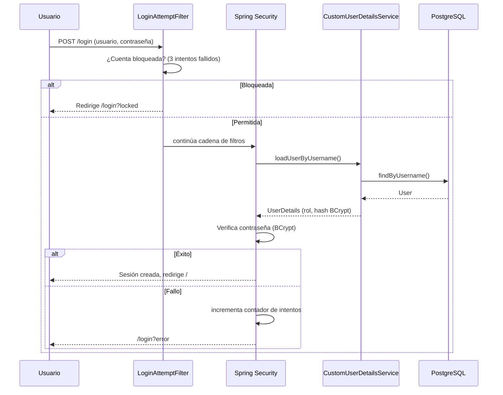
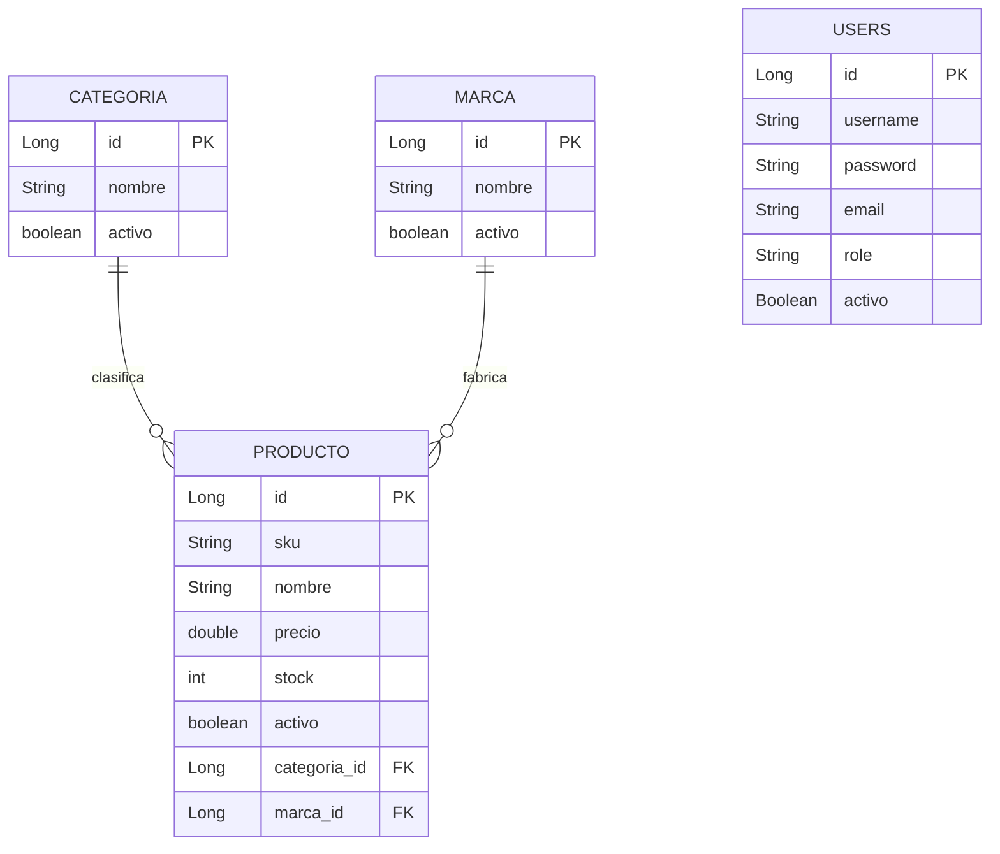

# Documento de Arquitectura — Kenpaku Ferretería

Aplicación web para la gestión de inventario (productos, categorías y marcas) de la
distribuidora ferretera **Kenpaku**, construida con **Spring Boot 4 / Java 21**.

---

## 1. Stack tecnológico

| Capa | Tecnología |
|------|------------|
| Lenguaje | Java 21 (LTS) |
| Framework | Spring Boot 4.0.6 (Web MVC, Data JPA, Security, Thymeleaf, Actuator) |
| Vistas | Thymeleaf + Tailwind CSS |
| Persistencia | Spring Data JPA / Hibernate |
| Base de datos | PostgreSQL 15 (producción) · H2 en memoria (pruebas) |
| Seguridad | Spring Security + BCrypt |
| Build | Maven 3.9 |
| Pruebas | JUnit 5, Mockito, AssertJ, Spring Boot Test |
| Contenedores | Docker / Docker Compose |

---

## 2. Arquitectura en capas (MVC + DAO)

El proyecto sigue el patrón **Modelo–Vista–Controlador** con una capa de servicios
para la lógica de negocio y una capa **DAO** (repositorios Spring Data) para el acceso
a datos.



### Responsabilidad de cada capa

- **Controlador**: recibe las peticiones HTTP, valida el formulario (`@Valid`) y
  delega en los servicios. No contiene lógica de negocio.
- **Servicio**: contiene la lógica de negocio (generación de SKU, filtros,
  activación/desactivación), gestiona transacciones (`@Transactional`) y traduce
  entre entidades y **DTOs**.
- **DAO / Repositorio**: interfaces `JpaRepository` que abstraen el acceso a datos.
- **Modelo**: entidades JPA que se mapean a tablas.

---

## 3. Seguridad (flujo de autenticación)



Medidas implementadas:

- **Hash BCrypt** para contraseñas (`PasswordEncoder`).
- **Bloqueo por intentos**: 3 intentos fallidos bloquean la sesión (`LoginAttemptService`).
- **Protección CSRF** activada por defecto (tokens inyectados por Thymeleaf).
- **Autorización por rol** (`ROLE_ADMIN`, `ROLE_USER`).
- Endpoints de Actuator protegidos salvo `health`/`info`.

---

## 4. Modelo de datos (entidad–relación)



---

## 5. Aplicación de principios SOLID

| Principio | Cómo se aplica en el proyecto |
|-----------|-------------------------------|
| **S** — Responsabilidad única | Cada clase tiene una única razón de cambio: `ProductoController` (HTTP), `ProductoService` (negocio), `ProductoRepository` (datos), `ProductoDTO` (transferencia). |
| **O** — Abierto/Cerrado | `GlobalExceptionHandler` permite añadir manejo de nuevas excepciones sin tocar los controladores. Los repositorios se extienden con métodos derivados sin modificar Spring Data. |
| **L** — Sustitución de Liskov | Los repositorios implementan `JpaRepository`; cualquier implementación de Spring Data es intercambiable. `CustomUserDetailsService` respeta el contrato de `UserDetailsService`. |
| **I** — Segregación de interfaces | Interfaces pequeñas y específicas por entidad (`ProductoRepository`, `UserRepository`) en lugar de un repositorio genérico gigante. |
| **D** — Inversión de dependencias | Todas las dependencias se inyectan por **constructor** contra abstracciones (interfaces de repositorio, `PasswordEncoder`), no contra implementaciones concretas. |

---

## 6. Estructura del proyecto

```
src/main/java/com/kenpaku/ferreteria/
├── KenpakuFerreteriaApplication.java   # punto de entrada
├── config/        # SecurityConfig, DataInitializer, filtros de login
├── controller/    # capa web (MVC)
├── service/       # lógica de negocio
├── repository/    # capa DAO (Spring Data JPA)
├── model/         # entidades JPA
├── dto/           # objetos de transferencia
└── exception/     # excepciones + manejador global
src/main/resources/
├── templates/     # vistas Thymeleaf
├── static/        # CSS
└── application.properties
src/test/java/      # pruebas unitarias e integración
scripts/            # backup, restore, cron (mantenimiento)
docs/               # documentación y planes
```
